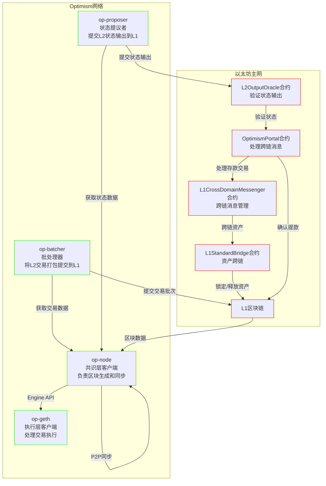

# Optimism 组件流程图

## 主要组件说明

### Layer 1组件
- **OptimismPortal**: 处理L1和L2之间的跨链消息传递
- **L2OutputOracle**: 验证和存储L2状态输出
- **L1CrossDomainMessenger**: 管理跨链消息的传递
- **L1StandardBridge**: 处理资产的跨链转移

### Layer 2组件
- **op-node**: 作为共识层客户端，负责区块生成和同步
- **op-geth**: 作为执行层客户端，处理交易执行
- **op-batcher**: 将L2交易打包并提交到L1
- **op-proposer**: 将L2状态输出提交到L1

## 主要流程说明

1. **区块同步流程**
   - op-node从L1获取区块数据
   - op-node通过Engine API与op-geth通信
   - op-node之间通过P2P网络同步数据

2. **交易处理流程**
   - op-batcher从op-node获取交易数据
   - op-batcher将交易打包后提交到L1
   - op-geth执行交易并更新状态

3. **状态提交流程**
   - op-proposer从op-node获取状态数据
   - op-proposer将状态输出提交到L2OutputOracle合约
   - L2OutputOracle验证状态输出

4. **跨链消息流程**
   - OptimismPortal处理跨链消息
   - L1CrossDomainMessenger管理消息传递
   - L1StandardBridge处理资产跨链