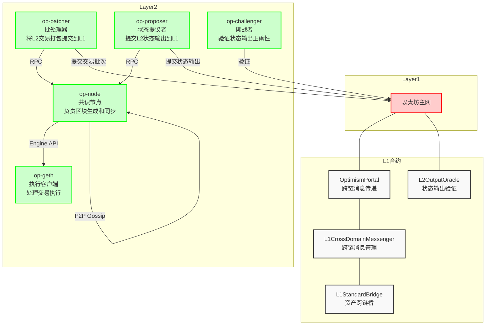

# Optimism 服务架构

## 核心服务说明

### op-node
- 功能：作为共识层客户端，负责区块生成和同步
- 接口：
  - Engine API：与执行层(op-geth)通信
  - P2P：节点间数据同步
  - RPC：供其他服务调用

### op-geth
- 功能：作为执行层客户端，处理交易执行
- 接口：
  - Engine API：与共识层(op-node)通信
  - JSON-RPC：标准以太坊RPC接口

### op-batcher
- 功能：将L2交易打包并提交到L1
- 接口：
  - RPC：从op-node获取交易数据
  - 合约调用：向L1提交交易批次

### op-proposer
- 功能：将L2状态输出提交到L1
- 接口：
  - RPC：从op-node获取状态数据
  - 合约调用：向L2OutputOracle提交状态输出

### op-challenger
- 功能：验证L2状态输出的正确性
- 接口：
  - 合约调用：验证L2OutputOracle中的状态输出

## 核心合约说明

### OptimismPortal
- 功能：处理L1和L2之间的跨链消息传递
- 接口：存款和提款交易处理

### L2OutputOracle
- 功能：验证和存储L2状态输出
- 接口：状态输出提交和验证

### L1CrossDomainMessenger
- 功能：管理跨链消息的传递
- 接口：消息打包和解析

### L1StandardBridge
- 功能：处理ETH和ERC20代币的跨链
- 接口：存款和提款操作